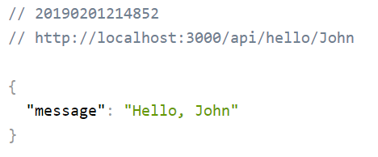
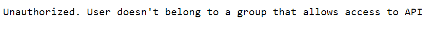

<h1 align="center">OAuth2 API Azure Auth and AuthZ</h1>

[Find it on GitHub](https://github.com/Microsoft-Projects/oauth2-api-azure/)

A node OAuth2 API on Azure Authentication and Authorization Role-Base-Access-Control (RBAC) wrapper providing support for OAuth2 token-based authentication and RBAC authorization scenarios for [typescript](https://www.typescriptlang.org/).

<p align="center">
    <a href="https://github.com/Microsoft-Projects/oauth2-api-azure/LICENSE"></a>
</p>

<br>

```js
import * as oauth from "oauth2-api-azure";
import * as authMiddleware from "oauth2-api-azure.middleware";
import express from "express";
import session from "express-session";

let app = express();
app.use(session());

// load auth settings
const authSettings: IAuthSettings { ... }
const passportAuthOptions: IPassportOptions { ... }

// init auth params
oauth.authInit(authSettings, validateUserRoleCallback);

// init auth middleware
const authMiddleware = new authentication.OAuthMiddleware(authSettings,passportAuthOptions, apiHostname, baseApiUrl);

// add Auth routes
app = authMiddleware.setAppHandler(app);

app.get('/api/get',
    // here goes the Azure OAuth2 Middleware
    authMiddleware.authenticate(SecurityStrategies.BEARER),
    (req, res) => {
        res.send('Hello World');
});

app.listen(3000)
```

## Installation

This is a [Node.js](https://nodejs.org/en/) module available through the
[npm registry](https://www.npmjs.com/).

Before installing, [download and install Node.js](https://nodejs.org/en/download/).
Node.js 0.10 or higher is required.

Installation is done using the
[`npm install` command](https://docs.npmjs.com/getting-started/installing-npm-packages-locally):

```bash
$ npm install oauth2-api-azure
```

Before beginning, you must configure and register your Web API in your Azure AD subscription. It is also expected that you are a Global Admin on your Azure AD.
Follow our [Azure AD Configuration Guide](AzureADConfigurationGuide.md) for more details.

Then, use our [sample projects](./examples) with your Azure AD settings to run and test your secure Web API.

## Features

- Hides complexity of OAuth2 implementation
- Focus on fast get started experience
- Supports interactive (user sign-in) and non-interactive (bearing the JWT token) authentication flow scenarios
- Test coverage
- Proven on multiple customer engagements

## Docs & Community

- [OAuth2 Azure API Documentation](./doc)
- [Microsoft Azure AD v2](https://docs.microsoft.com/en-us/azure/active-directory/develop/v2-overview) on a new Azure AD 2.0
- [OAuth 2.0](https://oauth.net/2/) for Official OAuth 2.0 documentation
- [Azure AD Authentication Libraries](https://docs.microsoft.com/en-us/azure/active-directory/develop/active-directory-authentication-libraries)

## Examples

To view and run the examples, clone the OAuth2-api-azure repo and install the dependencies:

```bash
$ git clone https://github.com/Microsoft-Projects/oauth2-api-azure.git --depth 1
$ cd oauth2-api-node
$ npm install

```

First, you must configure each example, please make sure the .env file exists in each sample directory and contains the valid settings for the following environment variables:

- TENANT_ID="d197a05e-...."
- CLIENT_ID="3d95c..."
- CLIENT_SECRET="LMJ#])?..."
- RESOURCE_ID="0472a9...."
- RBAC_GROUP="API Users" // only required for the authorization flow
- PORT=3000

### Authentication Example

To test the OAuth2 authentication scenario, go to the [authentication](./examples/authentication) sample folder. Make sure that you've completed the steps for Azure AD app registration shown in [AzureADConfigurationGuide](./AzureADConfigurationGuide.md) document.
Create a [.env]() file that should contain the environment variables for your Azure AD. Then install and run in the bash command line:

```bash
$ cd examples/authentication
$ npm install
$ npm start
```

You can test it from PostMan, Fiddler or any other UI where you could create the GET Http method and obtain the JWT token from Azure AD.

### User Authorization (RBAC) Example

To test the Azure AD RBAC authorization scenario, go to the [authorization](./examples/authorization) sample folder. Make sure that you've completed the steps for Azure AD app registration shown in [AzureADConfigurationGuide](./AzureADConfigurationGuide.md) document.
Create a [.env]() file that should contain the environment variables for your Azure AD. Then install and run in the bash command line:

```bash
$ cd examples/authorization
$ npm install
$ npm start
```

You can run it any internet browser, by going into the address line and typing the following URL:

```bash
http://localhost:3000/api/hello/John (or any other name of your choice)
```

If you've configured correctly your Azure AD and provided the valid environment settings, and after signing into your Azure AD with your credentials, you should expect to get the following message back:



Otherwise, if your user isn't member of the AD group specified in the environment variables .env file, or cannot be authenticated with Azure AD, you should expect to get the following message back:



## Tests

To run the test suite, first install the dependencies, then run `npm test`:

```bash
$ npm install
$ npm test
```

You can also constantly check for any changes to pass the test by running the following command:

```bash
$ npm run watch
```

## License

[MIT](LICENSE)
